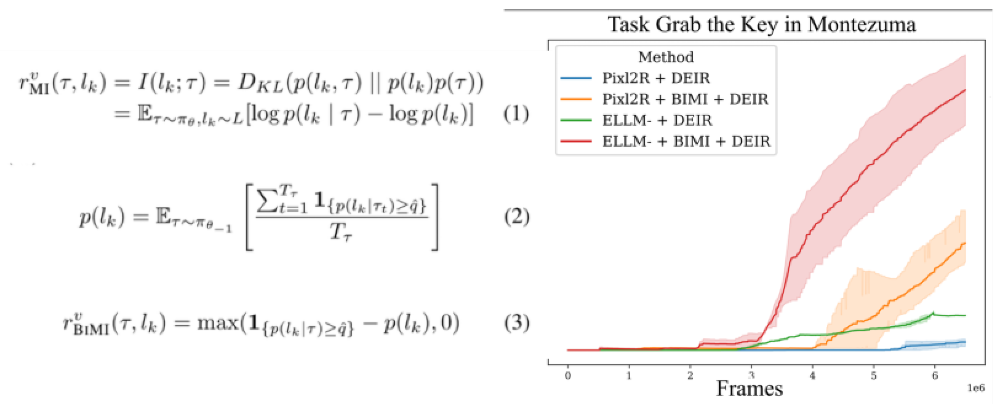
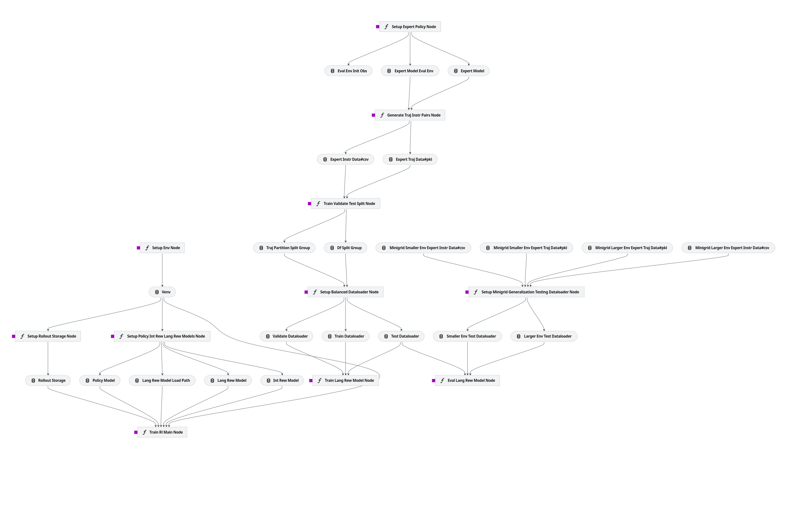

# Overcoming Reward Noise in Instruction-Guided RL Project



This repository contains the codebase for the paper **Overcoming Reward Model Noise in Instruction-Guided Reinforcement Learning #886**

> ***TL;DR:*** We show that false positive rewards in semantic similarity-based reward model is the primary reason for slowing down instruction-guided RL. So, we propose BiMI (Binary Mutual Information), a noise-robust reward function to address the issue. 


## Kedro Pipeline Overview


> [!IMPORTANT]
> This project utilizes the Kedro framework to enhance code modularity and ensure **reproducibility** to the greatest extent possible. If you encounter any issues related to **reproducibility**, please report them to the authors.

## Directory Structure
```bash
📂 Official-Overcoming-Reward-Noise-in-Instruction-Guided-RL
├── 📂 conf   # Configuration files
├── 📂 data     # Data directory (not included in the repository)
├── 📂 job_scripts # Bash scripts for running the pipeline
│   ├── 📂 lang_rew_model_pretrain      # Pretraining the language reward model
│   ├── 📂 rl_train_prelim     # Preliminary training of the RL policy
│   ├── 📂 stage_1_offline_eval  # Offline evaluation of the reward noise impact on the policy training
│   ├── 📂 stage_1_online_eval   # Online evaluation of the reward noise impact on the policy training
│   └── 📂 stage_2_online_eval   # Online evaluation of the BiMI reward function for enhancing the policy training
├── 📜 pyproject.toml
├── 📜 requirements.txt
└── 📂 src
    ├── 📂 better_alignment_signal_for_rl
    │   ├── 📂 agent_components   # Components for the RL agent
    │   ├── 📂 lang_rew_model_backbone     # Vision Language reward model (VLM) implementation
    │   ├── 📂 pipelines
    │   │   ├── 📂 env_setup      # RL Environment setup
    │   │   ├── 📂 eval_lrm       # Evaluation of the VLM
    │   │   ├── 📂 expert_policy_setup     # Expert policy setup
    │   │   ├── 📂 generate_traj_instr_pairs     # Trajectory and instruction pair generation for training the language reward model
    │   │   ├── 📂 minigrid_diff_env_testing_dataloader      # Generating the special Minigrid testing environment for evaluating the RL policy
    │   │   ├── 📂 pair_spliter_n_balancer    # Pair splitter and balancer for vision language reward model training data
    │   │   ├── 📂 reward_machine_setup    # Reward machine setup
    │   │   ├── 📂 rl_policy_setup   # RL policy setup
    │   │   ├── 📂 train_lang_rew_model    # Training the vision language reward model
    │   │   └── 📂 train_rl_policy   # Training the RL policy
    │   ├── 📂 ppo_backbone  # PPO implementation
```

> [!TIP]
> There are readme files in the subdirectories of the project. Please refer to them for more detailed information.

## Installation Steps
```bash
conda create --name=btrsignal python=3.10
conda activate btrsignal
# change directory to the project root
pip install -e .
```

## How to Run
To run the pipeline, please check the pipeline visualization in the `kedro-pipeline.png` file to make sure that you are running the correct order. The suggested order is as follows:
1. `env_setup`
2. `expert_policy_setup`
3. `generate_traj_instr_pairs`
4. `pair_spliter_n_balancer`
5. `train_lang_rew_model`
6. `eval_lrm`
7. `rl_policy_setup`
8. `train_rl_policy`

We suggest to check the bash scripts in the `job_scripts` directory for the reference of the pipeline execution.


## Known Issue

### `libstdc++.so.6` issue on conda environment

If you encounter the following error message:

```bash
MESA-LOADER: failed to open radeonsi: /home/xxxxxh/anaconda3/envs/minigrid/bin/../lib/libstdc++.so.6: version `GLIBCXX_3.4.30' not found (required by /usr/lib/dri/radeonsi_dri.so) (search paths /usr/lib/dri, suffix _dri)
failed to load driver: radeonsi
```


**Fixing libstdc++ Issue**:
 - If you're using **Anaconda**, it might be causing the problem.
 - Follow these steps to resolve it:
   1. Open a terminal or command prompt.
   2. Navigate to your Anaconda environment's library folder:
      ```
      cd /home/$USER/anaconda3/envs/$CondaEnv/lib
      ```
      (Replace `$USER` with your actual username.)
   3. Create a backup folder to keep the original **libstdc++**:
      ```bash
      mkdir backup
      ```
   4. Move all **libstdc++** files (including soft links) to the backup folder:
      ```bash
      mv libstd* backup
      ```
   5. Copy the system's **libstdc++.so.6** to your Anaconda environment:
      ```bash
      cp /usr/lib/libstdc++.so* ./
      ```

 - This should associate the correct **libstdc++** version with your system's driver.


### `render_mode="rgb_array" or "human"`

If you want to show the performance of your trained model, you can use `render_mode="human"`. However, when you want to train your model, you should use `render_mode="rgb_array"` and the engine will not render the display of the environment. 

