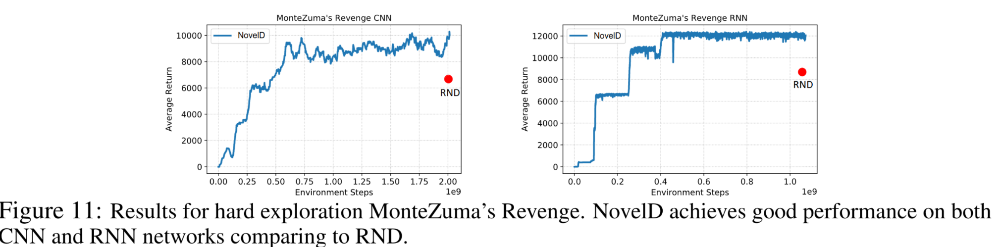

## notes

Things to test
- whether apply DEIR exploration strategy to RL policy learning 
- whether apply language reward model to RL policy learning

## Params
- `is_int_rew_activated`: True | False # indicating whether the RL policy learning will use DEIR exploration strategy to improve the exploration efficiency
- `is_lang_rew_activated`: True | False # indicating whether the RL policy learning will use language reward model to improve the alignment signal prediction
- `lang_rew_coef`: 1.0 # indicating the coefficient of the language reward when feed to the policy network
- `will_reset_vhead`: True | False # indicating whether the RL policy learning will reset the value head of the policy network after the language reward model deactivate some of the reward signals
- `has_boltzmann_rationality_coeff`: True | False # indicating whether the RL policy learning will use Boltzmann rationality coefficient to playdown the reward signals from the language reward model
- `has_intermittent_lang_rew_masking`: True | False # indicating whether the RL policy learning will use intermittent language reward masking to avoid overfitting to the language reward model
- `has_exponential_scaling`: True | False # indicating whether the RL policy learning will use exponential scaling to amplify the difference between good and bad alignment signals
- `has_conditional_mi`: True | False # set the reward r_{t+1} = min over i {th.pow(rawr_{t+1}, 2) / rawr_{i}} where i range from t-10 to t. Though it is derived from the conditional mutual information, we can treat it as a normalization technique.
- `has_dynamic_reward_inhibition` : True | False # indicating whether the RL policy learning will use dynamic reward inhibition to deactivate the reward signals from the language reward model
- `has_reward_capping`: True | False # indicating whether the RL policy learning will use reward capping to avoid wireheading / reward exploitation
- `capping_max`: 2.0 # indicating the maximum reward value for the reward capping, a perfect alignment for lang rew is 1.0 

## Intrinsic Reward Model Findings
- There are three testing envs for this project, "Crafter", "Minigrid" and "Montezuma's Revenge" in Atari 2600.
- DEIR Intrinsic RM works well in "Crafter" and "Minigrid" but not in "Montezuma's Revenge", the author mentions some possible reasons for this (See https://github.com/swan-utokyo/deir/issues/4#issuecomment-2154146692 ). We would argue that Montezuma's Revenge has a very special feature that may not fit the DEIR algorithm. Specifically, in "Montezuma's Revenge", actions such as "jump" can have prolonged effects, spanning multiple steps (e.g., a jump action might take 5 steps to complete during which time other actions are disregarded). This aspect is critical as the DEIR model primarily evaluates the relationship between an action taken at one step and the novelty of the observation at the next step. Therefore, when actions like jumping extend over several steps and suppress other actions, the model may inaccurately attribute the effects of the jump to these suppressed actions. This misunderstanding highlights a limitation of the DEIR model in adapting to scenarios where the effects of a single action are distributed over multiple steps.
- We therefore apply NovelD intrinsic RM to "Montezuma's Revenge". However, according to their paper, NovelD took 1.0e9 steps to converge, which is not feasible for our project. Our budget is 8.0e6 steps for "Montezuma's Revenge" and 1.0e6 steps for "Crafter" and "Minigrid". 

**Later we will see the impact of (noisy) Language Reward Signals on the RL agents**

## Issue for Montezuma's Revenge Env
We deem that 1M steps are not enough for RND or DEIR Intrinsic RM to converge in Montezuma's Revenge. Even for NovelD Intrinsic RM, it took about 1e8 steps to get first rewards.
